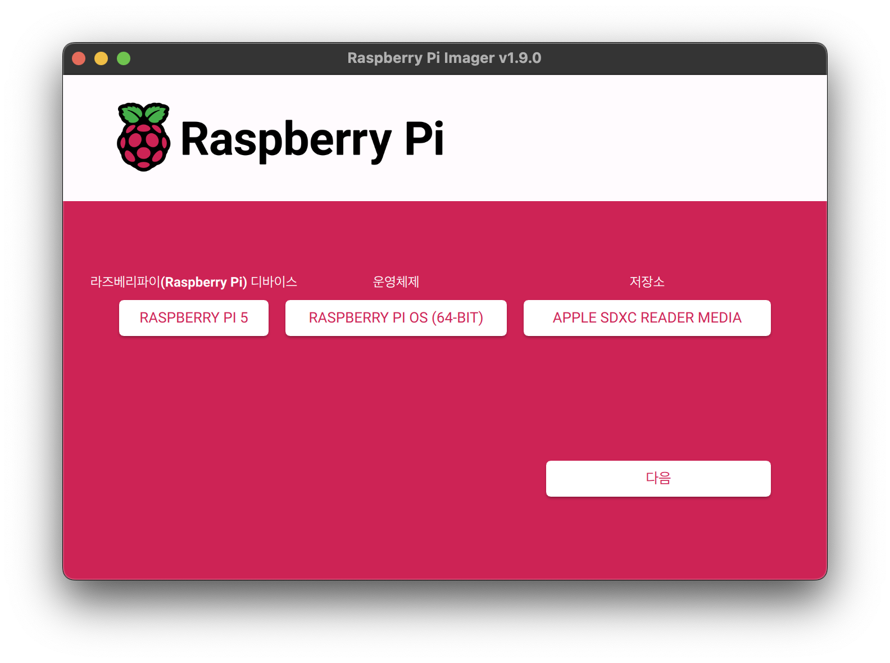
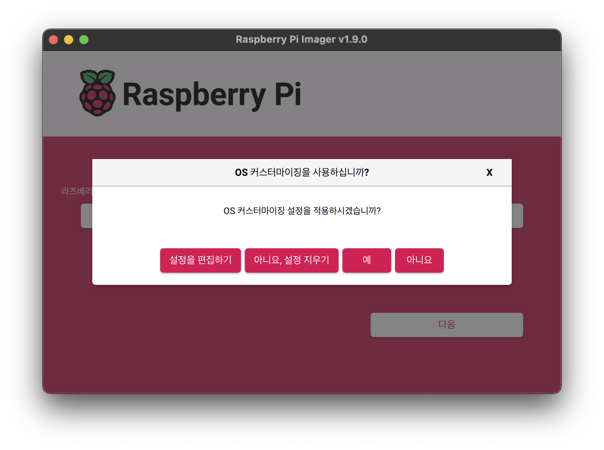
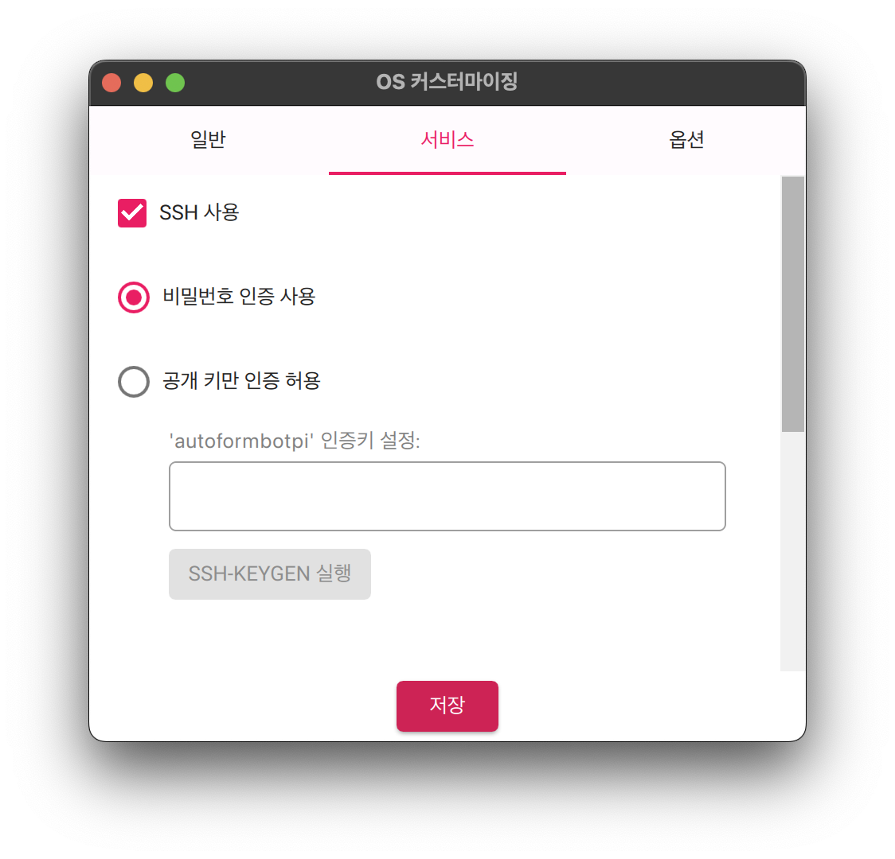
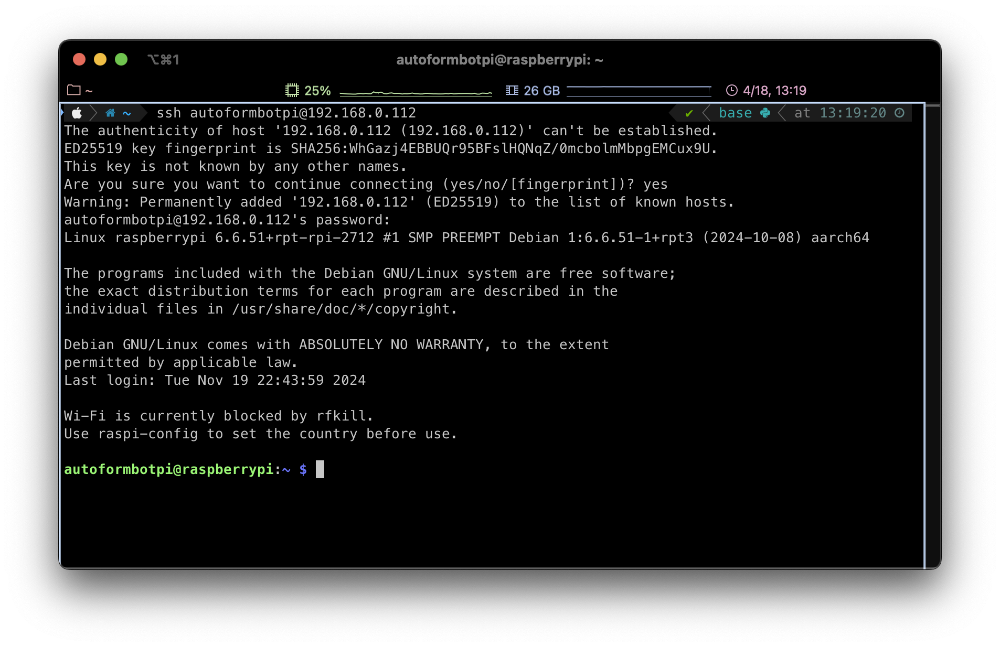
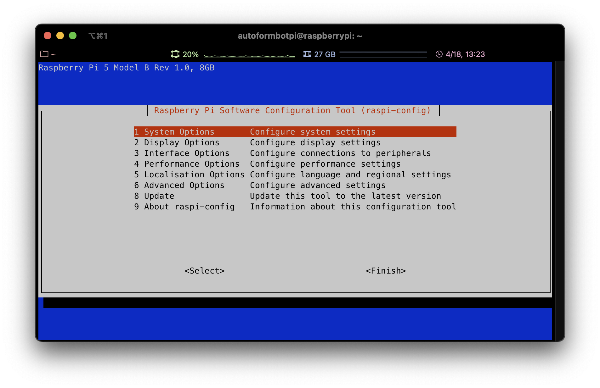
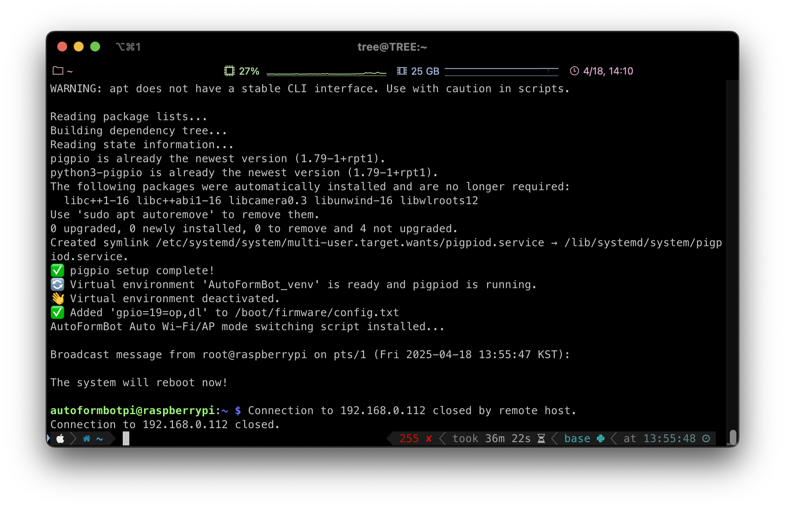
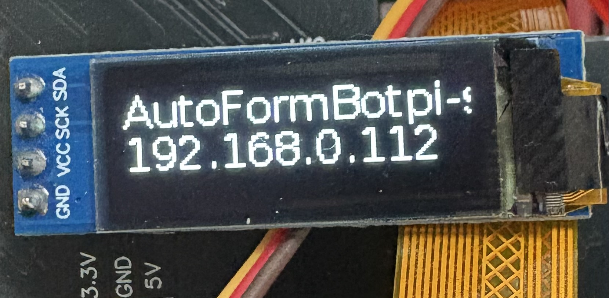

# 🚀 AutoFormBotCode

AutoFormBot의 코드 파일  
2025.04.17 기준 RPI5 BOOKWORM 환경에서 정상 동작 확인  

### 다음과 같은 기능 제공

wlan0 상황에 따라 AP/STA 모드 자동 전환  
AP모드시 유선랜 IP 0.91" OLED에서 확인 가능  
STA모드시 무선랜 IP와 현재 연결된 SSID 0.91" OLED에서 확인 가능  
사전 지정된 GPIO 핀맵  
스크립트를 통한 자동 설치

---

### 주의사항

네트워크 국가는 KR, wpa_supplicant을 통한 네트워크 관리가 아닌 NetworkManger를 통한 네트워크 관리

---

## 폴더 구성

| 폴더명 | 설명 |
|--------|------|
| `install/` | install 스크립트 위치 |
| `scripts/` | 각 기능별 설치 스크립트 및 기능 코드 모음|
| `images/` | 각종 사진들 |

---

## How To Install

### 0. Install Raspberrypi OS (BookWorm 64bit)

이미 Raspberry pi OS (Bookworm)이 설치되어있다면 1번 항목부터 실행  



Raspberry pi imager를 사용해 Raspberry Pi OS (Bookworm 64bit)를 설치




최초 설정시 설정을 편집하기에서 SSH 활성화 및 무선 LAN 설정 비활성화

### 1. Set rasp-config




```bash
sudo raspi-config
```
3-I3(VNC)          Enable  
3-I5(I2C)          Enable  
3-I8(Remote GPIO)  Enable  
5-L4(WLAN Country) KR  

Finsh  

### 2. git clone && Run the install.sh

```bash
cd ~
git clone https://github.com/2lectro-racoon/AutoFormBotCode.git
./AutoFormBotCode/install/install.sh
```

본 레포를 복사후 자동 설치 스크립트 실행.  
네트워크 환경에 따라 소요시간 차이가 있음.  
대략 20분 전후로 걸리기 때문에 커피한잔 하고 오는 것을 추천.  
설치가 완료된 후 자동으로 재부팅됨.  



### 3. Check AP & oled

재부팅후 아래와 같이 AP의 SSID가 검색되거나 OLED화면에 유선랜(연결되어있다면) IP가 뜨면 정상 설치된 것  



---

## AP모드에서 SSID 연결방법

AP의 SSID(AFM-setup)에 접속  
인터넷 브라우저에서 192.168.4.1:8080 입력후 로봇에 연결하고자 하는 SSID 및 PW 입력 후 저장  
만약에 숨겨진 인터넷이면 체크박스 선택  
잠시 기다리면 STA모드로 변경 및 해당 SSID에 연결 및 oled에서 IP확인 가능  

---
## Use Python venv and Package

파이썬 가상환경 활성화  

```bash
source AFB_venv/bin/activate
```

파이썬 가상환경 비활성화  

```bash
deactivate
```

패키지는 아래 링크 참조  

[패키지 설명](/scripts/package/)

---
## 라이선스

이 프로젝트는 비상업적인 목적에 한하여 자유롭게 사용, 수정, 배포하실 수 있습니다.  
반드시 출처를 명시해야 하며, 상업적 이용은 금지되어 있습니다.  
자세한 내용은 [LICENSE.txt](LICENSE.txt)를 참조하세요.

© 2025 Neogul (https://github.com/2lectro-racoon)  
© 2025 Echoglow