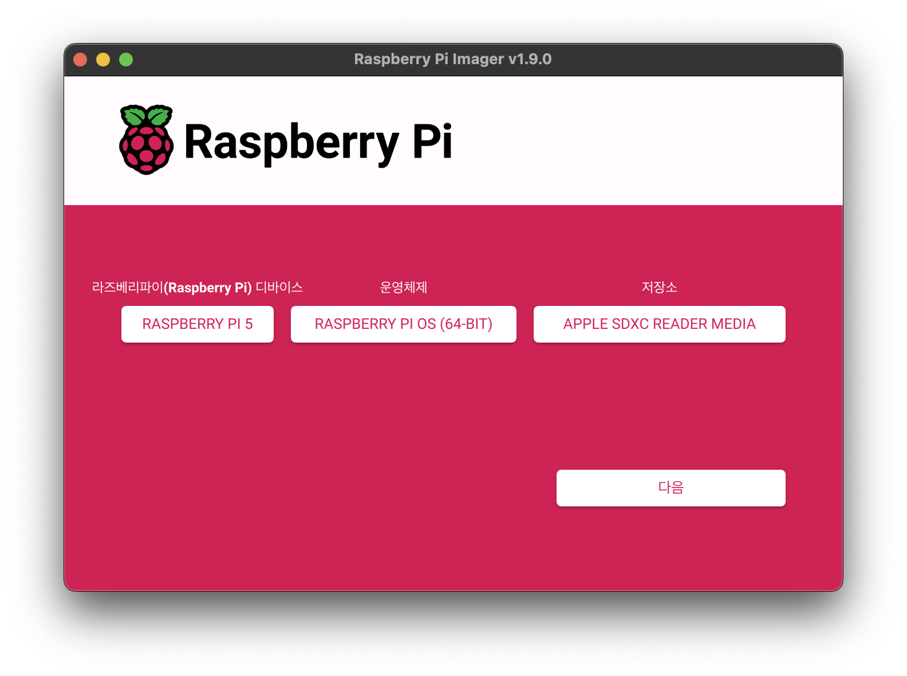
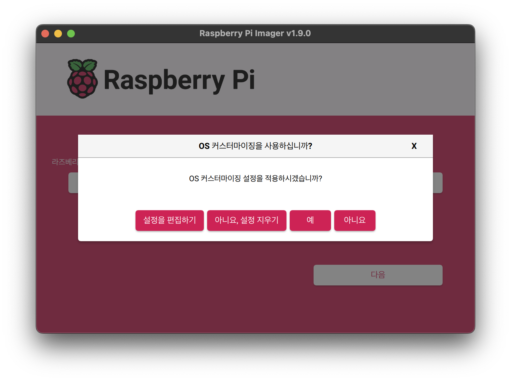
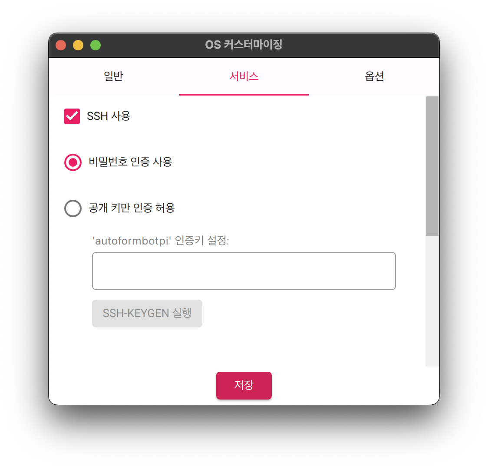
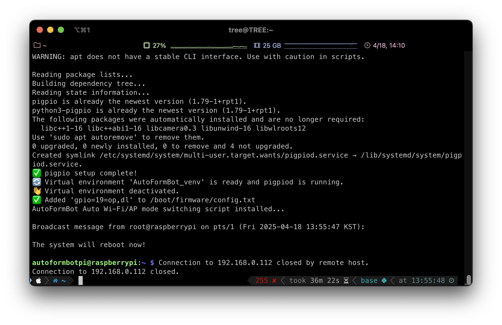
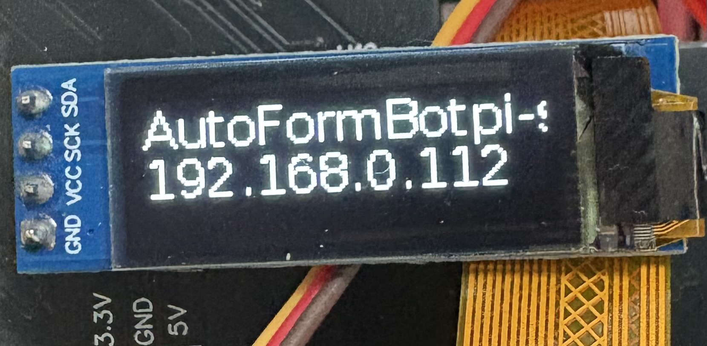

# 🚀 AutoFormBotCode

AutoFormBot의 코드 파일  
2025.04.17 기준 RPI5 BOOKWORM 환경에서 정상 동작 확인  

### 다음과 같은 기능 제공

5ghz AP 전용모드  
AP모드에서 유선랜 연결시 IP 0.91" OLED에서 확인 가능  
배터리 잔량을 0.91" OLED에서 확인 가능  
전면 TOF 센서 추가  
STM32 칩셋을 사용하는 커스텀 보드와 SPI 통신으로 제어  
스크립트를 통한 자동 설치

---

### 주의사항

초기 설치시에는 유선랜 연결 필수  

---

## 폴더 구성

| 폴더명 | 설명 |
|--------|------|
| `firmware/` | STM32 커스텀 보드 펌웨어 |
| `install/` | install 스크립트 위치 |
| `scripts/` | 각 기능별 설치 스크립트 및 기능 코드 모음|
| `images/` | 각종 사진들 |

---

## How To Install

### 0. Install Raspberrypi OS (BookWorm 64bit)

이미 Raspberry pi OS (Bookworm)이 설치되어있다면 1번 항목부터 실행  



Raspberry pi imager를 사용해 Raspberry Pi OS (Bookworm 64bit)를 설치



 

### 1. git clone && Run the install.sh

```bash
cd ~
git clone https://github.com/2lectro-racoon/AutoFormBotCode.git
sudo apt update && sudo apt upgrade -y
./AutoFormBotCode/install/install.sh
```

본 레포를 복사후 자동 설치 스크립트 실행.  
네트워크 환경에 따라 소요시간 차이가 있음.  
대략 20분 전후로 걸리기 때문에 커피한잔 하고 오는 것을 추천.  
설치가 완료된 후 자동으로 재부팅됨.  



### 2. Check AP & oled

재부팅 후 0.91" OLED가 동작 한다면 정상 설치 완료  



---

## Use Python venv and Package

### Method 1. 전용 경로 접속
```bash
cd ~/afb_home
```

### Method 2. 직접 가상환경 활성화

파이썬 가상환경 활성화  

```bash
source ~/.afbvenv/bin/activate
```

파이썬 가상환경 비활성화  

```bash
deactivate
```

패키지는 아래 링크 참조  

[패키지 설명](/scripts/package/)

---
## 라이선스

이 프로젝트는 비상업적인 목적에 한하여 자유롭게 사용, 수정, 배포하실 수 있습니다.  
반드시 출처를 명시해야 하며, 상업적 이용은 금지되어 있습니다.  
자세한 내용은 [LICENSE.txt](LICENSE.txt)를 참조하세요.

© 2026 Neogul (https://github.com/2lectro-racoon)  
© 2026 Codeplant